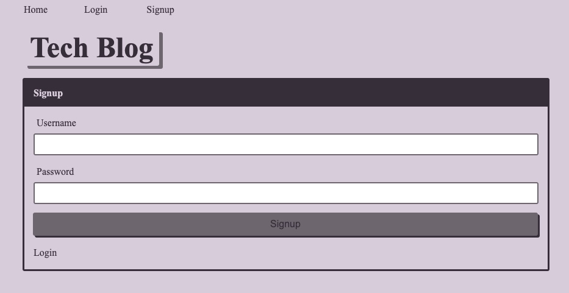
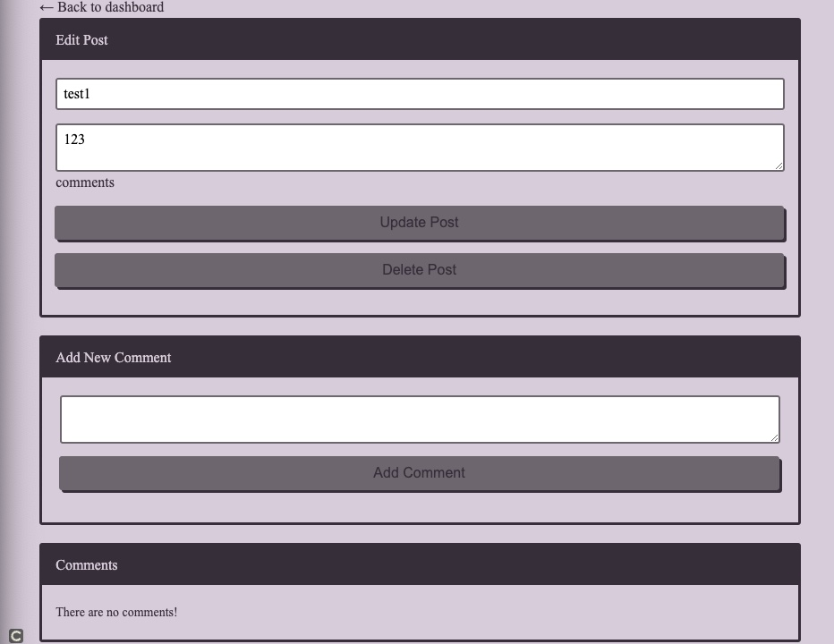

# Tech Blog

This projec tis a tech blog with both the frontend and backend. A MVC paradign was used for architectural structure. Tech Blog was built using Handlebars.js, Sequelize, and express-session npm package.

You can sign up, log in, add a post, edit a post, add a comment to a post, delete a post, and log out. 

***
## Install

To install all dependencies run:
```
npm install
``` 

***
## Usage
Run the following command at the root of your project starting with:
```
mysql -u root -p
``` 
Next, enter your password for MySQL. Once you are in your server run: 
```
SOURCE db/schema.sql
quit
``` 
Then run:
```
npm run start
```
You can download "https://insomnia.rest/download" manipulate/test the data with the GET, POST, PUT, DELETE request.

***

### [Homepage](https://protected-dawn-21307.herokuapp.com/)

### [Github] (https://github.com/Qaizen/tech-blog)


